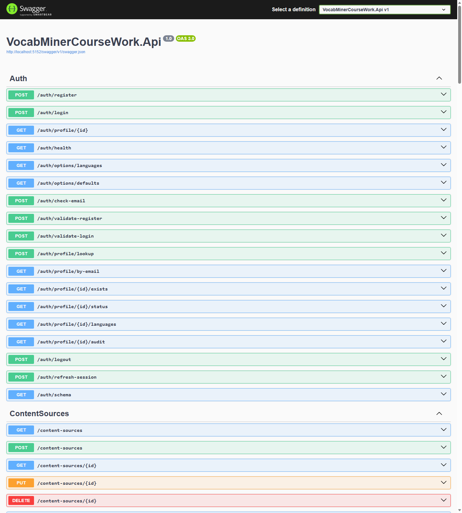
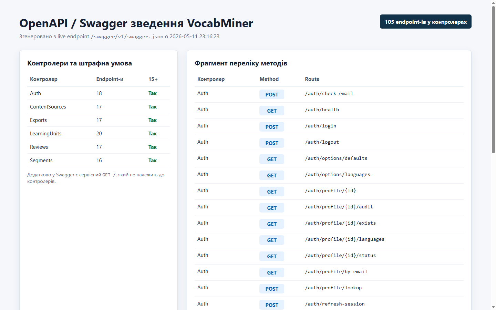
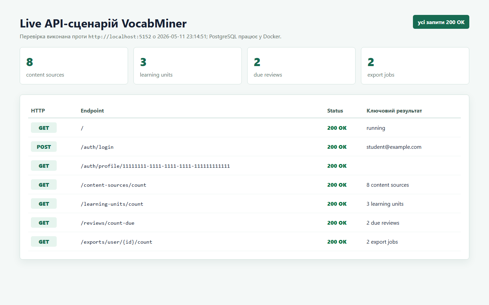

# Вінницький національний технічний університет______________

(повне найменування вищого навчального закладу)

Кафедра комп'ютерних наук_____________________________________________

(повна назва кафедри)

\pagebreak

# КУРСОВА РОБОТА

з дисципліни «Алгоритмізація та програмування»

(назва дисципліни)

на тему: «Розробка серверної частини інформаційної системи VocabMiner»

Студента 1 курсу, групи 4КН-25Б

Спеціальності 122 Комп'ютерні науки

Саволюк Микола Миколайович

(прізвище, ім'я, по батькові)

Керівник асистент кафедри комп'ютерних наук, аспірант Кудрявцев Дмитро Станіславович

(посада, науковий ступінь, прізвище та ініціали)

Національна шкала________________________

Кількість балів:______ Оцінка: ECTS_________

Члени комісії ________ __________________

(підпис) (прізвище та ініціали)

________ __________________

(підпис) (прізвище та ініціали)

м. Вінниця - 2026 рік

\pagebreak

# Міністерство освіти і науки України

Вінницький національний технічний університет

Факультет інформаційних технологій та комп'ютерної інженерії

Кафедра комп'ютерних наук

ЗАТВЕРДЖУЮ

Зав. каф. КН ______________________

«__» ____________ 2026 р.

# ІНДИВІДУАЛЬНЕ ЗАВДАННЯ

до курсової роботи з дисципліни «Алгоритмізація та програмування»

Студента Саволюка Миколи Миколайовича групи 4КН-25Б

Тема курсової роботи: «Розробка серверної частини інформаційної системи VocabMiner», затверджена на засіданні кафедри комп'ютерних наук, протокол № ___ від «__» ____________ 2026 р.

Вихідні дані:

1. Тип системи: серверна частина інформаційної системи для майнінгу словника з навчального контенту.
2. Архітектура: клієнт-серверна, з поділом на контролери, бізнес-логіку, репозиторії та доменні моделі.
3. База даних: PostgreSQL.
4. Технологія реалізації: ASP.NET Core 8, Entity Framework Core, Npgsql.
5. Основні сутності: користувачі, джерела контенту, сегменти, словникові одиниці, появи словникових одиниць, спроби повторення та завдання експорту.
6. Мінімальні вимоги: не менше 3 сутностей із 5 і більше полями, CRUD-операції, 5-8 контролерів, ViewModels, сервіси, репозиторії, dependency injection.
7. Середовище розробки: .NET 8 SDK, Docker, PostgreSQL.
8. Перевірка працездатності: unit-тести, HTTP-сценарій і live-перевірка з реальною PostgreSQL БД.

ЗМІСТ ПОЯСНЮВАЛЬНОЇ ЗАПИСКИ

Титульний лист.

Завдання на виконання.

Анотація.

Зміст.

Вступ.

1. Аналіз предметної області та постановка задачі.

2. Проєктування бази даних і серверної архітектури.

3. Програмна реалізація серверної частини.

4. Тестування та перевірка програмної реалізації.

Висновки.

Список використаних джерел.

Додатки.

ГРАФІЧНА ЧАСТИНА

1. Структура сутностей бази даних.
2. Схема серверної архітектури.
3. Скріншоти Swagger/OpenAPI та live API-сценарію.

Дата видачі «__» ____________ 2026 р.

Завдання видав ____________________ Кудрявцев Д. С.

Завдання отримав __________________ Саволюк М. М.

\pagebreak

# АНОТАЦІЯ

УДК ______

Саволюк М. М. Розробка серверної частини інформаційної системи VocabMiner. Курсова робота з дисципліни «Алгоритмізація та програмування». Вінниця: ВНТУ, 2026. Українською мовою.

У курсовій роботі розроблено серверну частину інформаційної системи VocabMiner, призначеної для збереження навчального контенту, виділення словникових одиниць із контексту, формування пояснень, організації повторення та експорту словника. Робота орієнтована на демонстрацію повного серверного циклу: від проєктування бази даних до реалізації контролерів, сервісів, репозиторіїв і перевірки працездатності API.

Серверну частину реалізовано на ASP.NET Core 8 з використанням PostgreSQL, Entity Framework Core та Npgsql. Структура проєкту побудована за багаторівневим підходом: контролери приймають HTTP-запити, сервіси виконують бізнес-логіку, репозиторії інкапсулюють доступ до даних, а доменні моделі описують сутності системи. У роботі спроєктовано 7 сутностей бази даних, реалізовано 6 контролерів і 105 HTTP endpoint-ів, підготовлено seed-дані, unit-тести та ручний HTTP-сценарій.

Практичну працездатність серверної частини підтверджено тестами бізнес-логіки та live-перевіркою з реальною PostgreSQL БД у Docker. Під час перевірки було застосовано міграцію Entity Framework Core, виконано імпорт контенту, створення сегментів, словникової одиниці, mock-пояснення, результату повторення та TSV-експорту.

\pagebreak

# ЗМІСТ

<!-- TOC -->

\pagebreak

# ВСТУП

Сучасні програмні системи дедалі частіше будуються як набір взаємопов'язаних серверних компонентів, які отримують запити від клієнтських застосунків, працюють із базою даних, виконують бізнес-логіку та повертають структуровані відповіді. Такий підхід є основою клієнт-серверної архітектури й широко використовується у вебзастосунках, мобільних сервісах, освітніх платформах і персональних продуктах для роботи з даними.

Однією з прикладних задач, для яких доцільно застосовувати серверну архітектуру, є підтримка вивчення іноземної лексики з реального контенту. У традиційному підході слова часто вивчаються ізольовано, без речення або ситуації, у якій вони були використані. Через це користувачу складніше запам'ятати значення слова, його вживання та зв'язок із ширшим контекстом. Система VocabMiner розглядає словникову одиницю не як окремий запис, а як елемент, пов'язаний із джерелом контенту, сегментом тексту, поясненням, повторенням і можливістю експорту.

Актуальність роботи полягає в тому, що вона поєднує навчальну предметну область із типовими задачами серверної розробки: моделюванням даних, реалізацією REST API, застосуванням dependency injection, розділенням відповідальності між рівнями системи та перевіркою працездатності з реальною базою даних. Такий проєкт дає змогу продемонструвати не лише окремі алгоритмічні або синтаксичні навички, а й здатність побудувати цілісний серверний застосунок.

Метою курсової роботи є розробка серверної частини інформаційної системи VocabMiner на основі клієнт-серверної архітектури з використанням ASP.NET Core 8, PostgreSQL та Entity Framework Core.

Об'єктом дослідження є процес побудови серверної частини інформаційної системи.

Предметом дослідження є архітектура, модель даних і програмна реалізація backend-системи для майнінгу словника з навчального контенту.

Для досягнення мети необхідно розв'язати такі завдання:

1. Проаналізувати предметну область системи VocabMiner і визначити основні сценарії використання.
2. Спроєктувати реляційну базу даних PostgreSQL, пов'язану з темою курсової роботи.
3. Організувати серверний проєкт за рівнями Controllers, Business Logic, Repositories і Domains.
4. Реалізувати контролери, ViewModels, сервіси, репозиторії та dependency injection.
5. Підготувати тестові дані, unit-тести й ручний HTTP-сценарій.
6. Перевірити працездатність серверної частини з реальною PostgreSQL БД.

\pagebreak

# 1 АНАЛІЗ ПРЕДМЕТНОЇ ОБЛАСТІ ТА ПОСТАНОВКА ЗАДАЧІ

## 1.1 Призначення системи VocabMiner

VocabMiner призначений для користувачів, які вивчають іноземну мову через реальний контент: субтитри, статті, діалоги, фрагменти відео або навчальні тексти. Основна ідея системи полягає в тому, щоб зберігати не лише слово або фразу, а й контекст, у якому ця словникова одиниця була знайдена. Такий підхід робить навчання ближчим до практичного використання мови, оскільки користувач бачить приклад уживання, пояснення та може повернутися до повторення пізніше.

У межах курсової роботи реалізовано серверну частину системи. Вона не містить повноцінного клієнтського інтерфейсу, але надає HTTP API, через який клієнтський застосунок може імпортувати текст, отримувати сегменти, створювати словникові одиниці, запускати пояснення, проходити повторення та створювати експорт. Таким чином, сервер виступає центральним рівнем, який зберігає стан системи та забезпечує доступ до нього через структуровані запити.

## 1.2 Основні сценарії використання

Типовий сценарій роботи починається з користувача, який має певний навчальний текст. Клієнтський застосунок надсилає цей текст на сервер, після чого сервер зберігає джерело контенту й автоматично розбиває його на сегменти. Сегментами можуть бути речення або короткі фрагменти, зручні для подальшого аналізу.

Після імпорту користувач може створити словникову одиницю на основі слова або фрази із сегмента. Система нормалізує термін, зберігає його, прив'язує до контексту й може сформувати mock-пояснення. У реальному продукті таке пояснення могло б створюватися за допомогою LLM API, але в курсовій реалізації використано mock-сервіс, щоб не залежати від зовнішніх сервісів і зосередитися на серверній архітектурі.

Далі користувач може переглядати список одиниць, проходити повторення, фіксувати результат і створювати експорт словника у CSV або TSV. Ці сценарії охоплюють основні операції над даними: створення, читання, оновлення, видалення, фільтрацію, формування похідних результатів і роботу з файлами експорту.

## 1.3 Аналіз вимог до курсової реалізації

Згідно з вимогами курсової роботи, серверний проєкт повинен містити базу даних, пов'язану з темою, не менше трьох сутностей із п'ятьма або більше полями, CRUD-операції, набір контролерів, ViewModels, сервіси бізнес-логіки, репозиторії та dependency injection. Окремою умовою було забезпечено розширений перелік endpoint-ів: у реалізованому проєкті кожен із шести контролерів має не менше 15 HTTP-запитів.

Тема VocabMiner добре відповідає цим вимогам, оскільки природно містить кілька пов'язаних сутностей: користувача, джерело контенту, сегмент, словникову одиницю, появу одиниці в тексті, спробу повторення та експорт. Кожна з цих сутностей має окрему роль у предметній області й може бути представлена таблицею реляційної бази даних.

## 1.4 Постановка задачі

Необхідно розробити серверну частину інформаційної системи VocabMiner, яка забезпечує збереження навчального контенту, поділ контенту на сегменти, створення словникових одиниць із контекстом, формування mock-пояснень, повторення матеріалу та експорт словника у файл. Сервер має працювати з PostgreSQL, використовувати Entity Framework Core для доступу до даних і надавати HTTP API для основних сценаріїв.

Результатом виконання роботи має бути інтегрований серверний застосунок, у якому контролери, сервіси, репозиторії та база даних пов'язані в єдиний програмний комплекс. Окрім коду, необхідно підготувати пояснювальну записку, ілюстративну частину, тестові дані та підтвердження працездатності системи.

\pagebreak

# 2 ПРОЄКТУВАННЯ БАЗИ ДАНИХ І СЕРВЕРНОЇ АРХІТЕКТУРИ

## 2.1 Вибір технологій

Для реалізації серверної частини обрано ASP.NET Core 8, оскільки ця платформа дає змогу створювати продуктивні Web API, має вбудовану підтримку dependency injection, middleware, конфігурації, логування та інтеграції зі Swagger/OpenAPI. Для зберігання даних використано PostgreSQL - реляційну СУБД, яка підтримує зовнішні ключі, індекси, транзакції та добре інтегрується з .NET через провайдер Npgsql.

Entity Framework Core використано як ORM-рівень між доменними класами та таблицями бази даних. Це дозволяє описати сутності як C#-класи, налаштувати зв'язки між ними та виконувати міграції схеми бази даних. Такий вибір відповідає навчальній меті роботи, оскільки демонструє зв'язок між моделлю предметної області, структурою бази даних і серверним кодом.

## 2.2 Проєктування сутностей бази даних

У системі спроєктовано сім основних сутностей. Їхній набір вибрано так, щоб охопити весь навчальний цикл: від імпорту контенту до повторення й експорту словника.

| Сутність | Призначення |
|---|---|
| `User` | Зберігає дані користувача, мови навчання та службову інформацію профілю. |
| `ContentSource` | Описує імпортоване джерело навчального контенту. |
| `Segment` | Містить окремий фрагмент або речення з джерела контенту. |
| `LearningUnit` | Представляє слово або фразу, яку користувач вивчає. |
| `Occurrence` | Зв'язує словникову одиницю з конкретним сегментом тексту. |
| `ReviewAttempt` | Зберігає результат повторення словникової одиниці. |
| `ExportJob` | Описує створений експорт словника у CSV або TSV. |

Кожна сутність містить щонайменше п'ять полів. Наприклад, `LearningUnit` має ідентифікатор, зв'язок із користувачем, термін, нормалізований термін, тип одиниці, переклад, пояснення, приклад речення, статус, складність, дату наступного повторення та службові часові поля. Така структура дозволяє зберігати не лише мінімальний словник, а й стан навчання.

## 2.3 Зв'язки між сутностями

Основним власником даних у системі є користувач. Один користувач може мати багато джерел контенту, багато словникових одиниць, багато спроб повторення та багато експортів. Джерело контенту складається з багатьох сегментів. Словникова одиниця може зустрічатися в кількох сегментах, тому між `LearningUnit` і `Segment` використовується проміжна сутність `Occurrence`.

Повторення винесені в окрему таблицю `ReviewAttempt`, оскільки вони представляють історію навчальних дій. Експорт також оформлено окремою сутністю `ExportJob`, що дозволяє зберігати формат, статус, назву файлу, кількість рядків і час завершення формування файлу.

## 2.4 Серверна архітектура

Серверний проєкт побудовано за багаторівневою архітектурою. Контролери відповідають за приймання HTTP-запитів і повернення відповідей. Сервіси бізнес-логіки виконують основні правила предметної області. Репозиторії інкапсулюють доступ до бази даних. Доменні моделі та ViewModels описують структуру внутрішніх даних і форматів взаємодії з API.

```text
Controllers -> Business Logic -> Repositories -> PostgreSQL
                         |
                         v
                      Domains
```

Такий поділ зменшує зв'язаність між частинами системи. Контролер не повинен знати, як саме виконується SQL-запит, а репозиторій не повинен містити правила навчального процесу. Це спрощує тестування, підтримку й подальше розширення системи.

## 2.5 Структура серверного проєкту

У проєкті створено папки, які відповідають вимогам курсової роботи та відображають архітектурні рівні системи.

| Папка | Призначення |
|---|---|
| `Controllers` | HTTP-контролери серверного API. |
| `Business Logic` | Сервіси, які виконують бізнес-логіку. |
| `Repositories` | Інтерфейси та реалізації доступу до даних. |
| `Domains/Entities` | Доменні сутності, пов'язані з таблицями бази даних. |
| `Domains/ViewModels` | Моделі запитів і відповідей API. |
| `Data` | DbContext і налаштування роботи з Entity Framework Core. |
| `Migrations` | Міграції схеми бази даних. |

Dependency injection налаштовано в `Program.cs`. Через DI-контейнер реєструються DbContext, репозиторії та сервіси. Завдяки цьому контролери отримують залежності через конструктори, а не створюють їх самостійно.

\pagebreak

# 3 ПРОГРАМНА РЕАЛІЗАЦІЯ СЕРВЕРНОЇ ЧАСТИНИ

## 3.1 Реалізація контролерів

У серверній частині реалізовано шість контролерів. Їхній набір охоплює головні функціональні області системи: автентифікацію, роботу з джерелами контенту, сегментами, словниковими одиницями, повтореннями та експортом.

| Контролер | Кількість endpoint-ів | Основне призначення |
|---|---:|---|
| `AuthController` | 18 | Реєстрація, авторизація, профіль користувача та допоміжні перевірки. |
| `ContentSourcesController` | 17 | Імпорт, перегляд, оновлення, видалення та аналіз джерел контенту. |
| `SegmentsController` | 16 | Отримання, пошук, редагування та контекстна навігація сегментами. |
| `LearningUnitsController` | 20 | Створення, оновлення, нормалізація, пояснення та керування словниковими одиницями. |
| `ReviewsController` | 17 | Черга повторення, історія, статистика та фіксація результатів. |
| `ExportsController` | 17 | Створення, перегляд, preview, завантаження та видалення експортів. |
| **Разом** | **105** | Повний набір HTTP-запитів серверної частини. |

Повна таблиця API-запитів із параметрами, типами, request/response ViewModels і типами результатів наведена в додатку А. В основному тексті доцільно подати лише підсумок, щоб не перевантажувати розділ довгою технічною таблицею.



Рисунок 3.1 - Загальний вигляд Swagger/OpenAPI серверного API.

## 3.2 Реалізація моделей і ViewModels

Доменні моделі описують сутності бази даних і використовуються всередині серверної частини. Наприклад, `ContentSource` представляє імпортований текст, `Segment` - його фрагмент, а `LearningUnit` - слово або фразу для вивчення. ViewModels відокремлюють внутрішню структуру даних від HTTP-контракту й визначають, які поля клієнт передає або отримує у відповіді.

Такий поділ є важливим для підтримки API. Якщо внутрішня сутність містить службові поля або навігаційні властивості Entity Framework Core, їх не обов'язково передавати клієнту. Натомість ViewModel задає контрольований формат запиту або відповіді.

## 3.3 Реалізація бізнес-логіки

Бізнес-логіка винесена в сервіси. `AuthService` відповідає за реєстрацію й перевірку користувача. `ContentImportService` імпортує текст і виконує поділ на сегменти. `LearningUnitService` створює та оновлює словникові одиниці, нормалізує терміни й прив'язує їх до контексту. `MockExplanationService` формує навчальне пояснення без звернення до зовнішнього AI API. `ReviewService` обчислює наступну дату повторення, а `ExportService` формує CSV або TSV-вміст.

Наприклад, під час імпорту контенту клієнт надсилає текст, назву, тип джерела й мову. Контролер приймає запит і передає його в сервіс. Сервіс створює сутність джерела, розбиває текст на сегменти, готує пов'язані записи й передає їх до репозиторію для збереження в базі даних. Такий потік демонструє зв'язок між HTTP API, бізнес-логікою та рівнем даних.

## 3.4 Реалізація репозиторіїв

Репозиторії інкапсулюють роботу з Entity Framework Core. Вони виконують пошук, фільтрацію, створення, оновлення та видалення записів. Завдяки цьому сервіси працюють із методами репозиторіїв і не залежать від конкретних LINQ-запитів або деталей DbContext.

Наприклад, репозиторій словникових одиниць відповідає за отримання одиниць користувача, пошук за статусом, пошук нормалізованого терміна та збереження змін. Репозиторій експортів зберігає інформацію про сформовані файли й дозволяє отримати їх за користувачем або ідентифікатором.

## 3.5 Інтеграція компонентів

Інтеграція серверної частини виконується в `Program.cs`. У цьому файлі налаштовуються контролери, JSON-серіалізація enum-типів, Swagger, підключення до PostgreSQL, DbContext, репозиторії та сервіси. Також передбачено можливість застосування міграцій під час запуску через параметр `ApplyMigrations`.



Рисунок 3.2 - Стислий огляд контролерів у Swagger/OpenAPI.

Після запуску сервер надає кореневий endpoint, який повертає службову відповідь зі статусом `running`, і підключає всі контролери через `MapControllers()`. У режимі розробки доступна сторінка Swagger, що дає змогу переглядати та вручну перевіряти API.

\pagebreak

# 4 ТЕСТУВАННЯ ТА ПЕРЕВІРКА ПРОГРАМНОЇ РЕАЛІЗАЦІЇ

## 4.1 Unit-тестування бізнес-логіки

Для перевірки серверної частини створено тестовий проєкт `VocabMinerCourseWork.Tests`. Він містить тести, які перевіряють ключові частини бізнес-логіки: поділ тексту на сегменти, нормалізацію словникової одиниці, розрахунок наступної дати повторення та формування TSV-експорту.

Такі тести не замінюють повної інтеграційної перевірки, але підтверджують, що основні алгоритмічні частини серверної логіки працюють очікувано. Особливо важливо, що тестування охоплює ті операції, які не є простим збереженням даних: сегментацію, нормалізацію, планування повторення та побудову експортного вмісту.

## 4.2 Ручний HTTP-сценарій

Окремо підготовлено файл `VocabMinerCourseWork.Api.http`, який дозволяє вручну пройти основний сценарій роботи системи. Сценарій включає авторизацію seed-користувача, імпорт контенту, перегляд сегментів, створення словникової одиниці, отримання mock-пояснення, проходження повторення, створення експорту та завантаження файлу.

Ручний сценарій важливий тому, що він перевіряє не окремий метод, а послідовну взаємодію кількох рівнів системи. Успішне проходження такого сценарію означає, що контролери, сервіси, репозиторії та база даних працюють узгоджено.

## 4.3 Перевірка з реальною PostgreSQL БД

Live-перевірку виконано 10 травня 2026 року з реальною PostgreSQL БД у Docker. Для запуску бази даних використано контейнер `vocabminer-coursework-postgres`. Після запуску Docker Compose контейнер перейшов у стан `healthy`, а API було запущено з параметром `ApplyMigrations=true`.

Під час старту сервер застосував міграцію Entity Framework Core `20260503183000_InitialCreate`. Наявність міграції підтверджено через таблицю `__EFMigrationsHistory`, у якій зафіксовано ProductVersion `8.0.0`.

Основні кроки live-сценарію наведено в таблиці 4.1.

| Крок | Endpoint | Результат |
|---|---|---|
| 1 | `GET /` | API повернув статус `running`. |
| 2 | `POST /auth/login` | Виконано вхід seed-користувача `student@example.com`. |
| 3 | `POST /content-sources` | Створено нове джерело контенту. |
| 4 | `GET /segments/content-source/{id}` | Отримано сегменти імпортованого тексту. |
| 5 | `POST /learning-units` | Створено словникову одиницю. |
| 6 | `POST /learning-units/{id}/explain` | Отримано mock-пояснення. |
| 7 | `POST /reviews/submit` | Збережено результат повторення. |
| 8 | `POST /exports` | Створено TSV-експорт. |
| 9 | `GET /exports/{id}/download` | Файл експорту завантажено, HTTP 200. |

Таблиця 4.1 - Основні кроки live-перевірки серверної частини.



Рисунок 4.1 - Live API-сценарій із реальною PostgreSQL БД.

## 4.4 Результати перевірки

Після виконання live-сценарію було підтверджено, що база даних створюється коректно, seed-дані застосовуються, міграція фіксується в історії EF Core, а сервер обробляє HTTP-запити з реальною PostgreSQL БД. Сценарій завершився успішним завантаженням TSV-файлу експорту.

Фінальна кількість записів у таблицях live PostgreSQL після виконання сценарію наведена в таблиці 4.2.

| Таблиця | Кількість записів |
|---|---:|
| `Users` | 1 |
| `ContentSources` | 8 |
| `Segments` | 16 |
| `LearningUnits` | 3 |
| `Occurrences` | 2 |
| `ReviewAttempts` | 2 |
| `ExportJobs` | 2 |

Таблиця 4.2 - Кількість записів у таблицях після live-перевірки.

Отже, тестування підтвердило працездатність реалізованої серверної частини. Unit-тести перевіряють ключові правила бізнес-логіки, а live-сценарій демонструє роботу повного ланцюга `HTTP API -> сервіс -> репозиторій -> PostgreSQL`.

\pagebreak

# ВИСНОВКИ

У результаті виконання курсової роботи було розроблено серверну частину інформаційної системи VocabMiner. Система призначена для роботи з навчальним контентом, створення словникових одиниць із контекстом, формування mock-пояснень, організації повторення та експорту словника у CSV або TSV.

У першому розділі було проаналізовано предметну область і сформульовано задачу розробки. Було визначено, що VocabMiner повинен підтримувати повний серверний цикл роботи з навчальними даними: імпорт тексту, сегментацію, створення словникових одиниць, прив'язку до контексту, повторення й експорт.

У другому розділі було спроєктовано базу даних і серверну архітектуру. Для зберігання даних обрано PostgreSQL, а для доступу до них - Entity Framework Core. У системі створено сім сутностей, кожна з яких має не менше п'яти полів і безпосередньо пов'язана з темою курсової роботи.

У третьому розділі було описано програмну реалізацію серверної частини. Проєкт організовано за рівнями `Controllers`, `Business Logic`, `Repositories` і `Domains`. Реалізовано шість контролерів, 105 HTTP endpoint-ів, ViewModels, сервіси, репозиторії та dependency injection. Такий підхід забезпечує розділення відповідальності між компонентами й полегшує підтримку системи.

У четвертому розділі було проведено тестування та перевірку реалізації. Unit-тести підтвердили роботу сегментації, нормалізації, планування повторення та експорту. Live-перевірка з реальною PostgreSQL БД підтвердила, що сервер застосовує міграції, працює з тестовими даними, обробляє HTTP-запити та виконує основний сценарій роботи VocabMiner.

Таким чином, поставлену мету досягнуто. Розроблена серверна частина відповідає вимогам курсової роботи, демонструє клієнт-серверну архітектуру, роботу з базою даних, CRUD-операції, бізнес-логіку, репозиторії, dependency injection і практичну перевірку працездатності.

\pagebreak

# СПИСОК ВИКОРИСТАНИХ ДЖЕРЕЛ

1. Матеріали дисципліни «Алгоритмізація та програмування».
2. Приклад оформлення курсової роботи `Lebid_1KN_20b.pdf`.
3. Опис вимог до курсової роботи з дисципліни «Алгоритмізація та програмування».
4. Microsoft Learn. ASP.NET Core Web API documentation.
5. Microsoft Learn. Entity Framework Core documentation.
6. PostgreSQL Documentation.
7. Npgsql Entity Framework Core Provider documentation.
8. Fowler M. Patterns of Enterprise Application Architecture. Addison-Wesley, 2002.

\pagebreak

# ДОДАТКИ

## Додаток А. Повний перелік API-запитів і ViewModels

### А.1. Повна таблиця API-запитів

У таблиці А.1 наведено базові HTTP-методи, параметри запитів, C#-типи, ViewModels та типи результатів, що повертаються методами контролерів. Службовий параметр `CancellationToken` використовується в асинхронних методах, але не є частиною HTTP-контракту, тому в таблиці не дублюється.

| Контролер | Метод і шлях | Призначення | Параметри та типи | Request ViewModel | Return type | Response ViewModel |
|---|---|---|---|---|---|---|
| `AuthController` | `POST /auth/register` | Реєстрація користувача | `body: RegisterRequest` | `RegisterRequest` | `Task<ActionResult<UserResponse>>` | `UserResponse` |
| `AuthController` | `POST /auth/login` | Авторизація користувача | `body: LoginRequest` | `LoginRequest` | `Task<ActionResult<UserResponse>>` | `UserResponse` |
| `AuthController` | `GET /auth/profile/{id}` | Отримання профілю | `route id: Guid` | немає | `Task<ActionResult<UserResponse>>` | `UserResponse` |
| `ContentSourcesController` | `GET /content-sources` | Список джерел користувача | `query userId: Guid` | немає | `Task<ActionResult<IReadOnlyList<ContentSourceResponse>>>` | `IReadOnlyList<ContentSourceResponse>` |
| `ContentSourcesController` | `GET /content-sources/{id}` | Отримання одного джерела | `route id: Guid` | немає | `Task<ActionResult<ContentSourceResponse>>` | `ContentSourceResponse` |
| `ContentSourcesController` | `POST /content-sources` | Імпорт нового контенту | `body: ContentSourceRequest` | `ContentSourceRequest` | `Task<ActionResult<ContentSourceResponse>>` | `ContentSourceResponse` |
| `ContentSourcesController` | `PUT /content-sources/{id}` | Оновлення джерела | `route id: Guid`; `body: ContentSourceUpdateRequest` | `ContentSourceUpdateRequest` | `Task<ActionResult<ContentSourceResponse>>` | `ContentSourceResponse` |
| `ContentSourcesController` | `DELETE /content-sources/{id}` | Видалення джерела | `route id: Guid` | немає | `Task<IActionResult>` | немає, повертає `NoContent` або `NotFound` |
| `SegmentsController` | `GET /segments/content-source/{contentSourceId}` | Сегменти джерела | `route contentSourceId: Guid` | немає | `Task<ActionResult<IReadOnlyList<SegmentResponse>>>` | `IReadOnlyList<SegmentResponse>` |
| `SegmentsController` | `GET /segments/{id}` | Отримання сегмента | `route id: Guid` | немає | `Task<ActionResult<SegmentResponse>>` | `SegmentResponse` |
| `SegmentsController` | `PUT /segments/{id}` | Оновлення тексту сегмента | `route id: Guid`; `body: SegmentUpdateRequest` | `SegmentUpdateRequest` | `Task<ActionResult<SegmentResponse>>` | `SegmentResponse` |
| `SegmentsController` | `DELETE /segments/{id}` | Видалення сегмента | `route id: Guid` | немає | `Task<IActionResult>` | немає, повертає `NoContent` або `NotFound` |
| `LearningUnitsController` | `GET /learning-units` | Список словникових одиниць | `query userId: Guid`; `query status: LearningStatus?`; `query search: string?` | немає | `Task<ActionResult<IReadOnlyList<LearningUnitResponse>>>` | `IReadOnlyList<LearningUnitResponse>` |
| `LearningUnitsController` | `GET /learning-units/{id}` | Отримання словникової одиниці | `route id: Guid` | немає | `Task<ActionResult<LearningUnitResponse>>` | `LearningUnitResponse` |
| `LearningUnitsController` | `POST /learning-units` | Створення словникової одиниці | `body: LearningUnitRequest` | `LearningUnitRequest` | `Task<ActionResult<LearningUnitResponse>>` | `LearningUnitResponse` |
| `LearningUnitsController` | `PUT /learning-units/{id}` | Оновлення словникової одиниці | `route id: Guid`; `body: LearningUnitUpdateRequest` | `LearningUnitUpdateRequest` | `Task<ActionResult<LearningUnitResponse>>` | `LearningUnitResponse` |
| `LearningUnitsController` | `DELETE /learning-units/{id}` | Видалення словникової одиниці | `route id: Guid` | немає | `Task<IActionResult>` | немає, повертає `NoContent` або `NotFound` |
| `LearningUnitsController` | `POST /learning-units/{id}/explain` | Mock-пояснення | `route id: Guid` | немає | `Task<ActionResult<ExplanationResponse>>` | `ExplanationResponse` |
| `LearningUnitsController` | `POST /learning-units/promote-phrase` | Створення фрази з сегмента | `body: PromotePhraseRequest` | `PromotePhraseRequest` | `Task<ActionResult<LearningUnitResponse>>` | `LearningUnitResponse` |
| `ReviewsController` | `GET /reviews/today/{userId}` | Список слів для повторення | `route userId: Guid` | немає | `Task<ActionResult<IReadOnlyList<ReviewResponse>>>` | `IReadOnlyList<ReviewResponse>` |
| `ReviewsController` | `GET /reviews/history/{userId}` | Історія повторень | `route userId: Guid` | немає | `Task<ActionResult<IReadOnlyList<ReviewAttemptResponse>>>` | `IReadOnlyList<ReviewAttemptResponse>` |
| `ReviewsController` | `POST /reviews/submit` | Збереження результату повторення | `body: ReviewSubmitRequest` | `ReviewSubmitRequest` | `Task<ActionResult<ReviewResponse>>` | `ReviewResponse` |
| `ReviewsController` | `POST /reviews/reset/{learningUnitId}` | Скидання прогресу | `route learningUnitId: Guid` | немає | `Task<ActionResult<ReviewResponse>>` | `ReviewResponse` |
| `ExportsController` | `POST /exports` | Створення експорту | `body: ExportCreateRequest` | `ExportCreateRequest` | `Task<ActionResult<ExportJobResponse>>` | `ExportJobResponse` |
| `ExportsController` | `GET /exports/user/{userId}` | Список експортів | `route userId: Guid` | немає | `Task<ActionResult<IReadOnlyList<ExportJobResponse>>>` | `IReadOnlyList<ExportJobResponse>` |
| `ExportsController` | `GET /exports/{id}` | Метадані експорту | `route id: Guid` | немає | `Task<ActionResult<ExportJobResponse>>` | `ExportJobResponse` |
| `ExportsController` | `GET /exports/{id}/download` | Завантаження файлу | `route id: Guid` | немає | `Task<IActionResult>` | немає, повертає файл `CSV/TSV` або `NotFound` |
| `ExportsController` | `DELETE /exports/{id}` | Видалення експорту | `route id: Guid` | немає | `Task<IActionResult>` | немає, повертає `NoContent` або `NotFound` |

Для виконання штрафної умови про мінімум 15 запитів на кожен контролер API було розширено додатковими endpoint-ами. Після розширення кожен із 6 контролерів має не менше 15 HTTP-запитів.

| Контролер | Кількість endpoint-ів |
|---|---:|
| `AuthController` | 18 |
| `ContentSourcesController` | 17 |
| `SegmentsController` | 16 |
| `LearningUnitsController` | 20 |
| `ReviewsController` | 17 |
| `ExportsController` | 17 |
| **Разом** | **105** |

Додаткові endpoint-и:

| Контролер | Метод і шлях | Призначення | Параметри та типи | Request ViewModel | Return type | Response ViewModel |
|---|---|---|---|---|---|---|
| `AuthController` | `GET /auth/health` | Перевірка доступності auth API | немає | немає | `ActionResult<ApiMessageResponse>` | `ApiMessageResponse` |
| `AuthController` | `GET /auth/options/languages` | Доступні мовні опції | немає | немає | `ActionResult<IReadOnlyList<EnumOptionResponse>>` | `IReadOnlyList<EnumOptionResponse>` |
| `AuthController` | `GET /auth/options/defaults` | Значення за замовчуванням для реєстрації | немає | немає | `ActionResult<RegisterDefaultsResponse>` | `RegisterDefaultsResponse` |
| `AuthController` | `POST /auth/check-email` | Перевірка доступності email | `body: EmailAvailabilityRequest` | `EmailAvailabilityRequest` | `Task<ActionResult<EmailAvailabilityResponse>>` | `EmailAvailabilityResponse` |
| `AuthController` | `POST /auth/validate-register` | Перевірка моделі реєстрації | `body: RegisterRequest` | `RegisterRequest` | `ActionResult<ValidationResponse>` | `ValidationResponse` |
| `AuthController` | `POST /auth/validate-login` | Перевірка моделі логіну | `body: LoginRequest` | `LoginRequest` | `ActionResult<ValidationResponse>` | `ValidationResponse` |
| `AuthController` | `POST /auth/profile/lookup` | Пошук профілю за email | `body: ProfileLookupRequest` | `ProfileLookupRequest` | `Task<ActionResult<UserResponse>>` | `UserResponse` |
| `AuthController` | `GET /auth/profile/by-email` | Отримання профілю за email | `query email: string` | немає | `Task<ActionResult<UserResponse>>` | `UserResponse` |
| `AuthController` | `GET /auth/profile/{id}/exists` | Перевірка існування профілю | `route id: Guid` | немає | `Task<ActionResult<ExistsResponse>>` | `ExistsResponse` |
| `AuthController` | `GET /auth/profile/{id}/status` | Активність і дата входу | `route id: Guid` | немає | `Task<ActionResult<UserStatusResponse>>` | `UserStatusResponse` |
| `AuthController` | `GET /auth/profile/{id}/languages` | Мови користувача | `route id: Guid` | немає | `Task<ActionResult<UserLanguageResponse>>` | `UserLanguageResponse` |
| `AuthController` | `GET /auth/profile/{id}/audit` | Технічні дані профілю | `route id: Guid` | немає | `Task<ActionResult<UserAuditResponse>>` | `UserAuditResponse` |
| `AuthController` | `POST /auth/logout` | Mock-вихід із системи | немає | немає | `ActionResult<ApiMessageResponse>` | `ApiMessageResponse` |
| `AuthController` | `POST /auth/refresh-session` | Mock-оновлення сесії | немає | немає | `ActionResult<ApiMessageResponse>` | `ApiMessageResponse` |
| `AuthController` | `GET /auth/schema` | Опис auth ViewModels | немає | немає | `ActionResult<ApiMessageResponse>` | `ApiMessageResponse` |
| `ContentSourcesController` | `GET /content-sources/recent` | Останні джерела | `query userId: Guid`; `query take: int` | немає | `Task<ActionResult<IReadOnlyList<ContentSourceResponse>>>` | `IReadOnlyList<ContentSourceResponse>` |
| `ContentSourcesController` | `GET /content-sources/count` | Кількість джерел | `query userId: Guid` | немає | `Task<ActionResult<CountResponse>>` | `CountResponse` |
| `ContentSourcesController` | `GET /content-sources/search` | Пошук у джерелах | `query userId: Guid`; `query term: string` | немає | `Task<ActionResult<IReadOnlyList<ContentSourceResponse>>>` | `IReadOnlyList<ContentSourceResponse>` |
| `ContentSourcesController` | `GET /content-sources/by-type` | Фільтр за типом джерела | `query userId: Guid`; `query sourceType: ContentSourceType` | немає | `Task<ActionResult<IReadOnlyList<ContentSourceResponse>>>` | `IReadOnlyList<ContentSourceResponse>` |
| `ContentSourcesController` | `GET /content-sources/languages` | Мови джерел користувача | `query userId: Guid` | немає | `Task<ActionResult<IReadOnlyList<string>>>` | `IReadOnlyList<string>` |
| `ContentSourcesController` | `GET /content-sources/{id}/summary` | Зведення джерела | `route id: Guid` | немає | `Task<ActionResult<ContentSourceSummaryResponse>>` | `ContentSourceSummaryResponse` |
| `ContentSourcesController` | `GET /content-sources/{id}/segments-count` | Кількість сегментів джерела | `route id: Guid` | немає | `Task<ActionResult<CountResponse>>` | `CountResponse` |
| `ContentSourcesController` | `GET /content-sources/{id}/preview` | Текстовий preview джерела | `route id: Guid`; `query length: int` | немає | `Task<ActionResult<TextPreviewResponse>>` | `TextPreviewResponse` |
| `ContentSourcesController` | `GET /content-sources/{id}/exists` | Перевірка існування джерела | `route id: Guid` | немає | `Task<ActionResult<ExistsResponse>>` | `ExistsResponse` |
| `ContentSourcesController` | `POST /content-sources/preview-segments` | Попередній поділ тексту | `body: TextSegmentationRequest` | `TextSegmentationRequest` | `ActionResult<SegmentPreviewResponse>` | `SegmentPreviewResponse` |
| `ContentSourcesController` | `POST /content-sources/validate` | Перевірка моделі імпорту | `body: ContentSourceRequest` | `ContentSourceRequest` | `ActionResult<ValidationResponse>` | `ValidationResponse` |
| `ContentSourcesController` | `GET /content-sources/types` | Доступні типи джерел | немає | немає | `ActionResult<IReadOnlyList<EnumOptionResponse>>` | `IReadOnlyList<EnumOptionResponse>` |
| `SegmentsController` | `GET /segments/{id}/exists` | Перевірка існування сегмента | `route id: Guid` | немає | `Task<ActionResult<ExistsResponse>>` | `ExistsResponse` |
| `SegmentsController` | `GET /segments/{id}/length` | Довжина сегмента | `route id: Guid` | немає | `Task<ActionResult<SegmentLengthResponse>>` | `SegmentLengthResponse` |
| `SegmentsController` | `GET /segments/{id}/context` | Попередній і наступний сегмент | `route id: Guid` | немає | `Task<ActionResult<SegmentContextResponse>>` | `SegmentContextResponse` |
| `SegmentsController` | `GET /segments/content-source/{contentSourceId}/count` | Кількість сегментів джерела | `route contentSourceId: Guid` | немає | `Task<ActionResult<CountResponse>>` | `CountResponse` |
| `SegmentsController` | `GET /segments/content-source/{contentSourceId}/first` | Перший сегмент джерела | `route contentSourceId: Guid` | немає | `Task<ActionResult<SegmentResponse>>` | `SegmentResponse` |
| `SegmentsController` | `GET /segments/content-source/{contentSourceId}/last` | Останній сегмент джерела | `route contentSourceId: Guid` | немає | `Task<ActionResult<SegmentResponse>>` | `SegmentResponse` |
| `SegmentsController` | `GET /segments/content-source/{contentSourceId}/range` | Діапазон позицій | `route contentSourceId: Guid`; `query from: int`; `query to: int` | немає | `Task<ActionResult<IReadOnlyList<SegmentResponse>>>` | `IReadOnlyList<SegmentResponse>` |
| `SegmentsController` | `GET /segments/content-source/{contentSourceId}/search` | Пошук у сегментах | `route contentSourceId: Guid`; `query term: string` | немає | `Task<ActionResult<IReadOnlyList<SegmentResponse>>>` | `IReadOnlyList<SegmentResponse>` |
| `SegmentsController` | `GET /segments/content-source/{contentSourceId}/positions` | Список позицій сегментів | `route contentSourceId: Guid` | немає | `Task<ActionResult<SegmentPositionsResponse>>` | `SegmentPositionsResponse` |
| `SegmentsController` | `POST /segments/split-preview` | Preview поділу тексту | `body: TextSegmentationRequest` | `TextSegmentationRequest` | `ActionResult<SegmentPreviewResponse>` | `SegmentPreviewResponse` |
| `SegmentsController` | `POST /segments/normalize-preview` | Preview нормалізації тексту | `body: SegmentUpdateRequest` | `SegmentUpdateRequest` | `ActionResult<NormalizedTextResponse>` | `NormalizedTextResponse` |
| `SegmentsController` | `GET /segments/content-source/{contentSourceId}/empty` | Порожні сегменти | `route contentSourceId: Guid` | немає | `Task<ActionResult<IReadOnlyList<SegmentResponse>>>` | `IReadOnlyList<SegmentResponse>` |
| `LearningUnitsController` | `GET /learning-units/count` | Кількість словникових одиниць | `query userId: Guid`; `query status: LearningStatus?` | немає | `Task<ActionResult<CountResponse>>` | `CountResponse` |
| `LearningUnitsController` | `GET /learning-units/due` | Одиниці, що вже потребують повторення | `query userId: Guid` | немає | `Task<ActionResult<IReadOnlyList<LearningUnitResponse>>>` | `IReadOnlyList<LearningUnitResponse>` |
| `LearningUnitsController` | `GET /learning-units/known` | Відомі одиниці | `query userId: Guid` | немає | `Task<ActionResult<IReadOnlyList<LearningUnitResponse>>>` | `IReadOnlyList<LearningUnitResponse>` |
| `LearningUnitsController` | `GET /learning-units/new` | Нові одиниці | `query userId: Guid` | немає | `Task<ActionResult<IReadOnlyList<LearningUnitResponse>>>` | `IReadOnlyList<LearningUnitResponse>` |
| `LearningUnitsController` | `GET /learning-units/mastered` | Засвоєні одиниці | `query userId: Guid` | немає | `Task<ActionResult<IReadOnlyList<LearningUnitResponse>>>` | `IReadOnlyList<LearningUnitResponse>` |
| `LearningUnitsController` | `GET /learning-units/ignored` | Проігноровані одиниці | `query userId: Guid` | немає | `Task<ActionResult<IReadOnlyList<LearningUnitResponse>>>` | `IReadOnlyList<LearningUnitResponse>` |
| `LearningUnitsController` | `GET /learning-units/search` | Пошук одиниць | `query userId: Guid`; `query term: string` | немає | `Task<ActionResult<IReadOnlyList<LearningUnitResponse>>>` | `IReadOnlyList<LearningUnitResponse>` |
| `LearningUnitsController` | `GET /learning-units/{id}/occurrences-count` | Кількість появ одиниці | `route id: Guid` | немає | `Task<ActionResult<CountResponse>>` | `CountResponse` |
| `LearningUnitsController` | `GET /learning-units/{id}/review-state` | Стан повторення | `route id: Guid` | немає | `Task<ActionResult<LearningUnitReviewStateResponse>>` | `LearningUnitReviewStateResponse` |
| `LearningUnitsController` | `POST /learning-units/normalize` | Нормалізація терміна | `body: LearningUnitNormalizeRequest` | `LearningUnitNormalizeRequest` | `ActionResult<LearningUnitNormalizeResponse>` | `LearningUnitNormalizeResponse` |
| `LearningUnitsController` | `POST /learning-units/{id}/mark-known` | Позначити як відоме | `route id: Guid` | немає | `Task<ActionResult<LearningUnitResponse>>` | `LearningUnitResponse` |
| `LearningUnitsController` | `POST /learning-units/{id}/mark-ignored` | Позначити як проігнороване | `route id: Guid` | немає | `Task<ActionResult<LearningUnitResponse>>` | `LearningUnitResponse` |
| `LearningUnitsController` | `POST /learning-units/{id}/mark-learning` | Позначити як у процесі вивчення | `route id: Guid` | немає | `Task<ActionResult<LearningUnitResponse>>` | `LearningUnitResponse` |
| `ReviewsController` | `GET /reviews/queue/{userId}` | Черга повторення | `route userId: Guid` | немає | `Task<ActionResult<IReadOnlyList<ReviewResponse>>>` | `IReadOnlyList<ReviewResponse>` |
| `ReviewsController` | `GET /reviews/count-due/{userId}` | Кількість due-карток | `route userId: Guid` | немає | `Task<ActionResult<CountResponse>>` | `CountResponse` |
| `ReviewsController` | `GET /reviews/history/{userId}/latest` | Останні спроби повторення | `route userId: Guid`; `query take: int` | немає | `Task<ActionResult<IReadOnlyList<ReviewAttemptResponse>>>` | `IReadOnlyList<ReviewAttemptResponse>` |
| `ReviewsController` | `GET /reviews/history/{userId}/count` | Кількість спроб повторення | `route userId: Guid` | немає | `Task<ActionResult<CountResponse>>` | `CountResponse` |
| `ReviewsController` | `GET /reviews/stats/{userId}` | Статистика повторень | `route userId: Guid` | немає | `Task<ActionResult<ReviewStatsResponse>>` | `ReviewStatsResponse` |
| `ReviewsController` | `GET /reviews/grades/options` | Доступні оцінки повторення | немає | немає | `ActionResult<IReadOnlyList<EnumOptionResponse>>` | `IReadOnlyList<EnumOptionResponse>` |
| `ReviewsController` | `GET /reviews/next/{learningUnitId}` | Наступне повторення одиниці | `route learningUnitId: Guid` | немає | `Task<ActionResult<LearningUnitReviewStateResponse>>` | `LearningUnitReviewStateResponse` |
| `ReviewsController` | `GET /reviews/{learningUnitId}/status` | Review-статус одиниці | `route learningUnitId: Guid` | немає | `Task<ActionResult<LearningUnitReviewStateResponse>>` | `LearningUnitReviewStateResponse` |
| `ReviewsController` | `POST /reviews/submit-again` | Швидка оцінка `Again` | `body: ReviewQuickSubmitRequest` | `ReviewQuickSubmitRequest` | `Task<ActionResult<ReviewResponse>>` | `ReviewResponse` |
| `ReviewsController` | `POST /reviews/submit-hard` | Швидка оцінка `Hard` | `body: ReviewQuickSubmitRequest` | `ReviewQuickSubmitRequest` | `Task<ActionResult<ReviewResponse>>` | `ReviewResponse` |
| `ReviewsController` | `POST /reviews/submit-good` | Швидка оцінка `Good` | `body: ReviewQuickSubmitRequest` | `ReviewQuickSubmitRequest` | `Task<ActionResult<ReviewResponse>>` | `ReviewResponse` |
| `ReviewsController` | `POST /reviews/submit-easy` | Швидка оцінка `Easy` | `body: ReviewQuickSubmitRequest` | `ReviewQuickSubmitRequest` | `Task<ActionResult<ReviewResponse>>` | `ReviewResponse` |
| `ReviewsController` | `POST /reviews/reset-today/{userId}` | Скидання due-карток користувача | `route userId: Guid` | немає | `Task<ActionResult<CountResponse>>` | `CountResponse` |
| `ExportsController` | `POST /exports/csv` | Створення CSV-експорту | `body: ExportCreateRequest` | `ExportCreateRequest` | `Task<ActionResult<ExportJobResponse>>` | `ExportJobResponse` |
| `ExportsController` | `POST /exports/tsv` | Створення TSV-експорту | `body: ExportCreateRequest` | `ExportCreateRequest` | `Task<ActionResult<ExportJobResponse>>` | `ExportJobResponse` |
| `ExportsController` | `GET /exports/user/{userId}/latest` | Останні експорти | `route userId: Guid`; `query take: int` | немає | `Task<ActionResult<IReadOnlyList<ExportJobResponse>>>` | `IReadOnlyList<ExportJobResponse>` |
| `ExportsController` | `GET /exports/user/{userId}/count` | Кількість експортів | `route userId: Guid` | немає | `Task<ActionResult<CountResponse>>` | `CountResponse` |
| `ExportsController` | `GET /exports/user/{userId}/completed` | Завершені експорти | `route userId: Guid` | немає | `Task<ActionResult<IReadOnlyList<ExportJobResponse>>>` | `IReadOnlyList<ExportJobResponse>` |
| `ExportsController` | `GET /exports/{id}/exists` | Перевірка існування експорту | `route id: Guid` | немає | `Task<ActionResult<ExistsResponse>>` | `ExistsResponse` |
| `ExportsController` | `GET /exports/{id}/metadata` | Метадані файлу експорту | `route id: Guid` | немає | `Task<ActionResult<ExportMetadataResponse>>` | `ExportMetadataResponse` |
| `ExportsController` | `GET /exports/{id}/preview` | Preview перших рядків файлу | `route id: Guid`; `query lines: int` | немає | `Task<ActionResult<ExportPreviewResponse>>` | `ExportPreviewResponse` |
| `ExportsController` | `GET /exports/{id}/content-type` | MIME-тип експорту | `route id: Guid` | немає | `Task<ActionResult<ApiMessageResponse>>` | `ApiMessageResponse` |
| `ExportsController` | `GET /exports/formats` | Доступні формати | немає | немає | `ActionResult<IReadOnlyList<EnumOptionResponse>>` | `IReadOnlyList<EnumOptionResponse>` |
| `ExportsController` | `GET /exports/statuses` | Доступні статуси export job | немає | немає | `ActionResult<IReadOnlyList<EnumOptionResponse>>` | `IReadOnlyList<EnumOptionResponse>` |
| `ExportsController` | `POST /exports/validate` | Перевірка моделі експорту | `body: ExportCreateRequest` | `ExportCreateRequest` | `ActionResult<ValidationResponse>` | `ValidationResponse` |

### А.2. ViewModels, що використовуються в API

| ViewModel | Тип | Поля та C#-типи |
|---|---|---|
| `RegisterRequest` | Request | `Email: string`; `DisplayName: string`; `Password: string`; `NativeLanguage: string`; `TargetLanguage: string` |
| `LoginRequest` | Request | `Email: string`; `Password: string` |
| `UserResponse` | Response | `Id: Guid`; `Email: string`; `DisplayName: string`; `NativeLanguage: string`; `TargetLanguage: string`; `CreatedAt: DateTime`; `LastLoginAt: DateTime?`; `IsActive: bool` |
| `ContentSourceRequest` | Request | `UserId: Guid`; `Title: string`; `SourceType: ContentSourceType`; `OriginalText: string`; `Language: string`; `Notes: string?` |
| `ContentSourceUpdateRequest` | Request | `Title: string`; `SourceType: ContentSourceType`; `OriginalText: string`; `Language: string`; `Notes: string?` |
| `ContentSourceResponse` | Response | `Id: Guid`; `UserId: Guid`; `Title: string`; `SourceType: ContentSourceType`; `OriginalText: string`; `Language: string`; `ImportedAt: DateTime`; `SegmentCount: int`; `Notes: string?` |
| `SegmentUpdateRequest` | Request | `Text: string` |
| `SegmentResponse` | Response | `Id: Guid`; `ContentSourceId: Guid`; `Position: int`; `Text: string`; `StartTime: TimeSpan?`; `EndTime: TimeSpan?`; `CreatedAt: DateTime` |
| `LearningUnitRequest` | Request | `UserId: Guid`; `Term: string`; `UnitType: LearningUnitType`; `Translation: string?`; `Explanation: string?`; `SegmentId: Guid?` |
| `LearningUnitUpdateRequest` | Request | `Term: string`; `UnitType: LearningUnitType`; `Translation: string?`; `Explanation: string?`; `ExampleSentence: string?`; `Status: LearningStatus`; `Difficulty: int` |
| `PromotePhraseRequest` | Request | `UserId: Guid`; `SegmentId: Guid`; `Phrase: string` |
| `LearningUnitResponse` | Response | `Id: Guid`; `UserId: Guid`; `Term: string`; `NormalizedTerm: string`; `UnitType: LearningUnitType`; `Translation: string?`; `Explanation: string?`; `ExampleSentence: string?`; `Status: LearningStatus`; `Difficulty: int`; `ReviewDueAt: DateTime`; `CreatedAt: DateTime`; `UpdatedAt: DateTime`; `OccurrenceCount: int` |
| `ExplanationResponse` | Response | `LearningUnitId: Guid`; `Term: string`; `Translation: string`; `Explanation: string`; `ExampleSentence: string` |
| `ReviewSubmitRequest` | Request | `UserId: Guid`; `LearningUnitId: Guid`; `Grade: ReviewGrade`; `ResponseTimeSeconds: int`; `Notes: string?` |
| `ReviewResponse` | Response | `LearningUnitId: Guid`; `Term: string`; `Translation: string?`; `Explanation: string?`; `ExampleSentence: string?`; `Status: LearningStatus`; `ReviewDueAt: DateTime` |
| `ReviewAttemptResponse` | Response | `Id: Guid`; `LearningUnitId: Guid`; `Grade: ReviewGrade`; `ResponseTimeSeconds: int`; `ReviewedAt: DateTime`; `NextDueAt: DateTime`; `Notes: string?` |
| `ExportCreateRequest` | Request | `UserId: Guid`; `Format: ExportFormat`; `FilterStatus: LearningStatus?` |
| `ExportJobResponse` | Response | `Id: Guid`; `UserId: Guid`; `Format: ExportFormat`; `FileName: string`; `Status: ExportStatus`; `FilterStatus: LearningStatus?`; `CreatedAt: DateTime`; `CompletedAt: DateTime?`; `RowCount: int` |
| `ApiMessageResponse` | Response | `Message: string`; `GeneratedAt: DateTime` |
| `CountResponse` | Response | `Scope: string`; `Count: int` |
| `ExistsResponse` | Response | `Id: Guid`; `Exists: bool` |
| `ValidationResponse` | Response | `IsValid: bool`; `Errors: IReadOnlyList<string>` |
| `EnumOptionResponse` | Response | `Name: string`; `Value: int` |
| `EmailAvailabilityRequest` | Request | `Email: string` |
| `EmailAvailabilityResponse` | Response | `Email: string`; `IsAvailable: bool` |
| `ProfileLookupRequest` | Request | `Email: string` |
| `RegisterDefaultsResponse` | Response | `NativeLanguage: string`; `TargetLanguage: string`; `MinPasswordLength: int` |
| `UserStatusResponse` | Response | `UserId: Guid`; `IsActive: bool`; `LastLoginAt: DateTime?` |
| `UserLanguageResponse` | Response | `UserId: Guid`; `NativeLanguage: string`; `TargetLanguage: string` |
| `UserAuditResponse` | Response | `UserId: Guid`; `CreatedAt: DateTime`; `LastLoginAt: DateTime?`; `IsActive: bool` |
| `TextSegmentationRequest` | Request | `Text: string`; `MaxSegments: int` |
| `SegmentPreviewResponse` | Response | `SegmentCount: int`; `Segments: IReadOnlyList<string>` |
| `ContentSourceSummaryResponse` | Response | `Id: Guid`; `Title: string`; `SourceType: ContentSourceType`; `Language: string`; `SegmentCount: int`; `ImportedAt: DateTime`; `TextLength: int` |
| `TextPreviewResponse` | Response | `Id: Guid`; `Preview: string`; `Length: int` |
| `SegmentContextResponse` | Response | `SegmentId: Guid`; `Position: int`; `PreviousText: string?`; `CurrentText: string`; `NextText: string?` |
| `SegmentLengthResponse` | Response | `SegmentId: Guid`; `CharacterCount: int`; `WordCount: int` |
| `SegmentPositionsResponse` | Response | `ContentSourceId: Guid`; `Positions: IReadOnlyList<int>` |
| `NormalizedTextResponse` | Response | `OriginalText: string`; `NormalizedText: string` |
| `LearningUnitNormalizeRequest` | Request | `Term: string` |
| `LearningUnitNormalizeResponse` | Response | `Term: string`; `NormalizedTerm: string` |
| `LearningUnitReviewStateResponse` | Response | `LearningUnitId: Guid`; `Status: LearningStatus`; `Difficulty: int`; `ReviewDueAt: DateTime`; `IsDue: bool` |
| `ReviewQuickSubmitRequest` | Request | `UserId: Guid`; `LearningUnitId: Guid`; `ResponseTimeSeconds: int`; `Notes: string?` |
| `ReviewStatsResponse` | Response | `UserId: Guid`; `DueCount: int`; `HistoryCount: int`; `AgainCount: int`; `HardCount: int`; `GoodCount: int`; `EasyCount: int` |
| `ExportMetadataResponse` | Response | `Id: Guid`; `FileName: string`; `Format: ExportFormat`; `Status: ExportStatus`; `RowCount: int`; `CreatedAt: DateTime`; `CompletedAt: DateTime?`; `ContentType: string` |
| `ExportPreviewResponse` | Response | `Id: Guid`; `FileName: string`; `Lines: IReadOnlyList<string>` |

У запитах використовуються такі enum-типи: `ContentSourceType`, `LearningUnitType`, `LearningStatus`, `ReviewGrade`, `ExportFormat`, `ExportStatus`. Вони зберігаються в базі як рядкові значення через налаштування Entity Framework Core.

\pagebreak

## Додаток Б. Приклад JSON-запиту імпорту контенту

```json
{
  "userId": "11111111-1111-1111-1111-111111111111",
  "title": "Sample dialogue",
  "sourceType": "PlainText",
  "originalText": "I want to learn vocabulary from real content.\nContext makes every phrase easier to remember.",
  "language": "en",
  "notes": "Manual test import"
}
```

## Додаток В. Приклад JSON-запиту створення словникової одиниці

```json
{
  "userId": "11111111-1111-1111-1111-111111111111",
  "term": "context",
  "unitType": "Word",
  "segmentId": "33333333-3333-3333-3333-333333333331"
}
```

## Додаток Г. Фрагмент доменної моделі

```csharp
public class LearningUnit
{
    public Guid Id { get; set; }
    public Guid UserId { get; set; }
    public string Term { get; set; } = string.Empty;
    public string NormalizedTerm { get; set; } = string.Empty;
    public LearningUnitType UnitType { get; set; }
    public string? Translation { get; set; }
    public string? Explanation { get; set; }
    public LearningStatus Status { get; set; }
    public DateTime ReviewDueAt { get; set; }
}
```

## Додаток Д. Фрагмент бізнес-логіки повторення

```csharp
public static DateTime CalculateNextDueAt(DateTime reviewedAt, ReviewGrade grade, int difficulty)
{
    var days = grade switch
    {
        ReviewGrade.Again => 0,
        ReviewGrade.Hard => 1,
        ReviewGrade.Good => Math.Max(2, 4 - difficulty),
        ReviewGrade.Easy => Math.Max(4, 7 - difficulty),
        _ => 1
    };

    return reviewedAt.AddDays(days);
}
```
